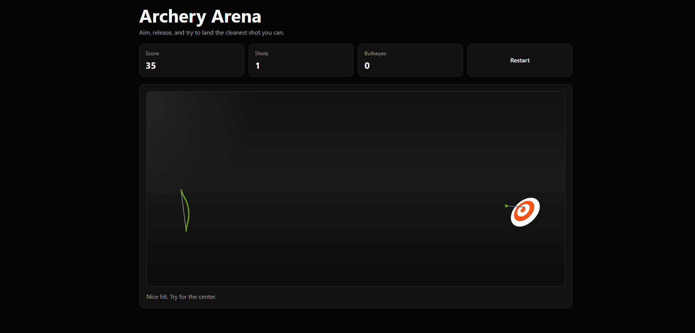

# 🎯 Archery Arena

A simple and interactive archery game built using modern web technologies. Test your aim, release the arrow, and try to hit the bullseye for the highest score possible.

## 🚀 Features

- 🏹 Realistic bow and arrow mechanics
- 🎯 Target-based scoring system
- 📊 Live score tracking
- 🔥 Bullseye counter
- 🎮 Interactive gameplay
- 🔄 Restart game functionality
- 🌙 Modern dark-themed UI

## 📸 Screenshot



## 🛠️ Technologies Used

- HTML5
- CSS3
- JavaScript
- Canvas API (if used)

## 🎮 How to Play

1. Open the game in your browser.
2. Click and drag the bowstring to aim.
3. Release to shoot the arrow.
4. Try to hit the center of the target for maximum points.
5. Track your score and bullseyes.
6. Press **Restart** to start a new game.

## 📂 Project Structure

```bash
Archery-Arena/
│
├── index.html
├── style.css
├── script.js
├── Screenshot.png
└── README.md
```

## ⚙️ Installation

1. Clone the repository:

```bash
git clone https://github.com/your-username/Archery-Arena.git
```

2. Navigate to the project folder:

```bash
cd Archery-Arena
```

3. Open `index.html` in your browser.

## 🎯 Scoring System

- Closer shots to the center earn higher points.
- Bullseye hits are counted separately.
- Total score updates in real time.

## 🔮 Future Improvements

- Sound effects
- Multiple difficulty levels
- Moving targets
- Leaderboard system
- Mobile responsiveness
- Power meter for shots

## 🤝 Contributing

Contributions are welcome. Feel free to fork the repository and submit a pull request.

## 📄 License

This project is licensed under the MIT License.

---

Made with ❤️ by **Butcher**
